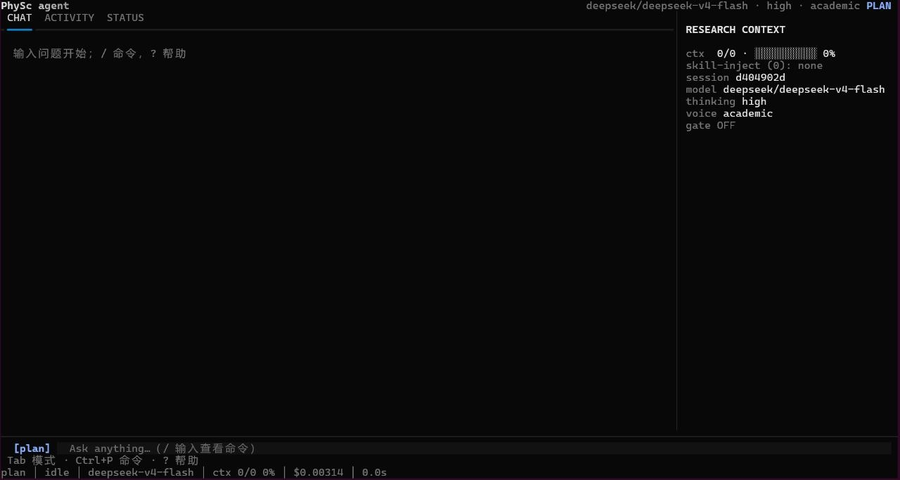

<div align="center">
  
</div>

# PhySc-agent

> A local-first academic agent for physics & materials science research — literature search, paper reading, note-taking, and document generation, with every claim traceable to a source page number.
>
> 面向物理/材料科学研究的本地学术 agent：检索文献、阅读总结、整理笔记、生成文档。自己实现 agent loop、记忆检索、缓存经济学与文件沙箱，**每句论断都能追溯到原文页码**。

**Version** v0.1.0 · **Stack** Python 3.11+ · DeepSeek V4-Flash API · hand-written ReAct loop (no LangGraph/LangChain) · multi-provider (deepseek/zhipu/openai/anthropic/kimi/mimo + custom) · Textual TUI

**License** MIT

---

## 中文文档

### 它能做什么

| 模式 | 能力 | 示例 |
|------|------|------|
| `plan` | 只读侦察：搜文献/读 PDF/出规划 | "帮我搜 2024-2026 钙钛矿稳定性方向文献并规划" |
| `investigate` | 全功能：下载/解析/总结/笔记 | "下载这篇并总结存笔记" |
| `typeset` | 文档生成：笔记 Markdown → PPTX/PDF | "把 notes/xx.md 做成 PPT" |

### 界面预览

<div align="center">
  
</div>

### 差异化卖点

1. **引用溯源闸门**（请求级触发）：输出后 LLM 校验每个论断是否有 evidence 支撑（source_id + 页码 + 原文片段），无证据论断列出警告——对抗学术幻觉
2. **定向阅读三段式**：论文总结强制"贡献 / 与你的关系 / 可改进点"，读论文 = 服务你的研究方向
3. **缓存经济学**：前缀字节稳定 + ExactCache + query 向量缓存，成本压到约 $0.003/轮，当日成本 telemetry 可见（状态栏实时显示服务端 prefix 命中率）
4. **实体差异守卫**：语义缓存命中前用 difflib+正则检测两 query 的差异片段是否含实体（Mn3Ga/Mn3Sn、年份、数值、型号、ID）——同形不同义强制 miss，防污染语义缓存
5. **长任务两阶段**：复杂任务先只读出计划（落 plans/），再重建上下文全工具执行，每 3 步写回进度摘要——防 Lost in the Middle
6. **方案拷问**：动手前先输出关键假设与范围风险，简单任务自动跳过
7. **跨模式上下文**：切换 plan/investigate/typeset 保留最近 3 轮对话，指代不丢失
8. **Hermes 式状态栏**：底栏常驻 `[模式] │ 状态 │ 模型 │ 上下文占用 │ 服务端命中率 │ 本轮耗时 │ 总时长 │ 时钟`，工具调用显示耗时，/ 自动补全 + 方向键编辑

### 快速开始

```bash
git clone <repo-url> && cd phxsc-agent
python3 -m venv .venv && source .venv/bin/activate
pip install -e .

# 1. 设置 DeepSeek API Key（必须）——两种方式任选：
export DEEPSEEK_API_KEY=sk-你的key        # 方式 A：环境变量
# 方式 B：项目根 .env 文件（复制 .env.example，KEY=VALUE 每行，# 注释）

# 2. （可选）语义记忆用智谱 embedding——不设也能用：
#    语义缓存自动降级为 exact-only，记忆混合检索退化为 FTS5
export ZHIPU_API_KEY=你的智谱key

# 3. 启动（默认 investigate 模式）
.venv/bin/python -m phxsc.cli

# 指定模式启动 / 指定工作目录
.venv/bin/python -m phxsc.cli --mode plan
.venv/bin/python -m phxsc.cli --workdir /path/to/workdir   # 或设 PHXSC_WORKDIR
```

### 斜杠命令

```
/plan /investigate /typeset   切换模式（重建上下文）
/new                           新会话（清对话日志，不清记忆）
/gate <问题>                  引用溯源闸门（问题前加 /gate，本轮请求级校验）
/thinking [off|low|medium|high]  思考力度（默认 high；无参=显示当前；设置持久化跨会话）
/model [provider/模型名 | 模型名]  查看/切换模型（含斜杠=跨 provider，如 /model zhipu/glm-4.5-air）
/provider [名称]                 查看 provider 列表（★=当前）/ 切换 provider
/voice [academic|natural]      文本风格（默认 academic；natural=去 AI 味面向人读）
/moa <任务>                    多模型并行调研/问答/生成（主控拆解→N 模型并行→聚合）
/dedup [--file]                查重（三源索引库：PDF/evidence/摘要）
/schedule list|add|rm          定时任务（如 /schedule add "每天 9:00" 钙钛矿）
/cache stats|clear [semantic|exact|all]  缓存统计 / 确认式清空（命中时回答后显示 ⚡ 语义缓存命中）
/sessions /search /resume /fork  会话管理与恢复
/skill list|load|unload        技能管理（list 查看全部 / load <name> 加载 / unload <name> 卸载）
/mcp list|status               MCP servers 连接状态（phxsc.mcp.json 配置）
/stop                          中断当前任务（最长 60s 内必生效）
/help                          命令帮助
/exit                          退出
```

### skill 体系

PhySc 内置 **skill 体系**（SKILL.md，对齐 agentskills.io 开放标准，天然兼容 Claude Code 的 `.claude/skills/` 与 Codex 的 `.codex/skills/`）。目录两级：**项目级 `skills/`**（随项目分发）+ **用户级 `~/.phxsc/skills/`**（个人私有，`PHXSC_SKILLS` 环境变量可覆盖用户级路径）。项目级首发：

| skill | 用途 |
|-------|------|
| `citation-format` | 引用格式纪律与证据标注规范 |
| `review-writing` | 综述写作规范（文献回顾/比较分析） |
| `three-part-reading` | 定向阅读三段式总结模板（贡献/关系/可改进点） |
| `physics-solid-state` | 固体物理/半导体物理方法论 |
| `humanizer` | 去 AI 味文本风格 |
| `academic-formatting-standards` / `academic-svg-diagrams` / `latex-cjk-pdf` / `latex-math-formatting-iso` | 学术排版/绘图/LaTeX 规范 |

**加载机制（缓存经济学）**：①元数据表（全部 skill 的 name+description）启动时一次性组装进 system prompt（区1，字节稳定缓存不破）；②skill 正文走 `skill_load` 工具返回（区2）；③`/skill load <name>` 把正文加入注入轨（全文注入不截断）；④路由交给 LLM 自匹配。预算：同时加载 ≤8 个。

### MCP 客户端

通过 `<项目根>/phxsc.mcp.json` 配置外部 MCP server（stdio / HTTP 双 transport），启动时自动连接并把工具动态注册进 ToolRegistry（命名 `mcp_<server>_<工具名>`，LLM 可自动调用）。配置缺失/损坏自动回落空配置，单 server 失败不阻塞其他，`/mcp list|status` 查看状态。

### 环境变量

| 变量 | 作用 |
|------|------|
| `DEEPSEEK_API_KEY` | DeepSeek API Key（必填） |
| `ZHIPU_API_KEY` | 智谱 embedding key（不设则语义缓存降级为 exact-only） |
| `TAVILY_API_KEY` | Tavily 网页搜索 key（.env 或环境变量；不设则该工具不可用） |
| `PHXSC_WORKDIR` | 工作目录（默认 `<项目根>/workspace`） |
| `PHXSC_DB` | 记忆库路径 |
| `PHXSC_EMBED_BACKEND` | `api`（默认，智谱）/ `local`（本地 bge 离线，需安装 memory extra） |
| `PHXSC_LLM_TIMEOUT` / `PHXSC_LLM_STREAM_TIMEOUT` | 非流式 300s / 流式 chunk 60s 超时覆盖 |
| `PHXSC_LONGTASK` | `0` 禁用长任务两阶段 |
| `PHXSC_HYBRID_THRESHOLD` | 记忆混合检索启用阈值（默认 1000） |
| `PHXSC_TELEMETRY_PATH` | telemetry 输出路径 |

### 测试

```bash
pip install -e ".[dev]"
.venv/bin/python -m pytest tests/ -q
```

1592 tests 全绿（v0.1.0 基线）。架构与设计细节见 [docs/ARCHITECTURE.md](ARCHITECTURE.md)、[docs/USER_GUIDE.md](USER_GUIDE.md)。

### 设计借鉴与版权

- 内置工具思路复用作者自研 skill（academic-paper-retrieval / scihub-cdp-download / zotero-import，均无第三方 license）
- 设计借鉴 Hermes AGENTS.md（MIT, Nous Research）——前缀缓存神圣 / narrow waist / 能力在边缘
- 架构借鉴 Reasonix/DeepSeek-Reasonix（MIT, esengine）——四区上下文模型、Cache-First Loop、Turn-end auto-compaction
- 沙箱双机制借鉴 Hermes agent/file_safety.py（MIT）
- 不拷贝任何第三方代码；arXiv/智谱/DeepSeek 均为公开 API

---

## English

### What it does

A local-first terminal agent for physics & materials science research. Three modes:

| Mode | Capability |
|------|-----------|
| `plan` | Read-only reconnaissance: search literature / read PDFs / produce a plan |
| `investigate` | Full workflow: download / parse / summarize / take notes |
| `typeset` | Document generation: notes Markdown → PPTX / PDF |

### Differentiators

1. **Citation grounding gate** (per-request): after answering, the LLM verifies every factual claim has an evidence entry (source_id + page + verbatim excerpt); unsupported claims are listed as warnings — built against academic hallucination
2. **Directed three-part reading**: paper summaries are forced into "contribution / relation to your research / possible improvements"
3. **Cache economics**: byte-stable prefix + exact cache + query-vector semantic cache, ~$0.003/turn typical; live server-side prefix hit rate in the status bar
4. **Entity-difference guard**: before a semantic-cache hit, difflib+regex checks whether the query diff contains entities (chemical formulas, years, numbers, model IDs) — same-shape-different-meaning forces a miss
5. **Two-phase long tasks**: complex tasks first output a plan (saved to plans/), then rebuild context with full tools and write progress summaries every 3 steps — against Lost-in-the-Middle
6. **Plan grilling**: critical assumptions and scope risks are surfaced before acting (auto-skipped for trivial tasks)
7. **Cross-mode context**: switching modes keeps the recent 3 turns, references don't break
8. **Status bar**: `[mode] │ state │ model │ ctx usage │ prefix hit rate │ turn time │ total │ clock`, slash-command autocomplete, arrow-key history

### Quick start

```bash
git clone <repo-url> && cd phxsc-agent
python3 -m venv .venv && source .venv/bin/activate
pip install -e .

export DEEPSEEK_API_KEY=sk-xxx        # required
export ZHIPU_API_KEY=xxx              # optional: semantic embedding (degrades gracefully)

.venv/bin/python -m phxsc.cli         # start (investigate mode by default)
.venv/bin/python -m phxsc.cli --mode plan
```

### Slash commands

```
/plan /investigate /typeset   switch mode (rebuild context)
/new                           new session (keep memory)
/gate <question>              citation grounding gate for this turn
/thinking [off|low|medium|high]  reasoning effort (default high, persisted)
/model [provider/model]       switch model (cross-provider with slash)
/provider [name]              list/switch provider
/voice [academic|natural]     text style
/moa <task>                   multi-model parallel research/QA/generation
/dedup [--file]               plagiarism check (3-source index)
/schedule list|add|rm         scheduled tasks
/cache stats|clear            cache stats / confirmed clear
/sessions /search /resume /fork  session management
/skill list|load|unload       skill management
/mcp list|status              MCP server status
/stop                         interrupt current task (≤60s guaranteed)
/help /exit
```

### Environment variables

| Variable | Purpose |
|----------|---------|
| `DEEPSEEK_API_KEY` | DeepSeek API key (required) |
| `ZHIPU_API_KEY` | Zhipu embedding key (optional; degrades to exact-only cache) |
| `TAVILY_API_KEY` | Tavily web search key (optional) |
| `PHXSC_WORKDIR` | Work directory (default `<project root>/workspace`) |
| `PHXSC_DB` | Memory database path |
| `PHXSC_EMBED_BACKEND` | `api` (default) / `local` (offline bge, requires memory extra) |
| `PHXSC_LLM_TIMEOUT` / `PHXSC_LLM_STREAM_TIMEOUT` | LLM timeouts: 300s / 60s defaults |
| `PHXSC_LONGTASK` | `0` disables two-phase long tasks |
| `PHXSC_HYBRID_THRESHOLD` | Hybrid retrieval threshold (default 1000 memories) |

### Tests

```bash
pip install -e ".[dev]"
.venv/bin/python -m pytest tests/ -q    # 1592 passed (v0.1.0 baseline)
```

### Credits & license

- Architecture inspired by Hermes AGENTS.md (MIT, Nous Research) and Reasonix/DeepSeek-Reasonix (MIT, esengine) — four-zone context model, cache-first loop
- No third-party code is copied; arXiv / Zhipu / DeepSeek are public APIs
- MIT License — see [LICENSE](../LICENSE)
